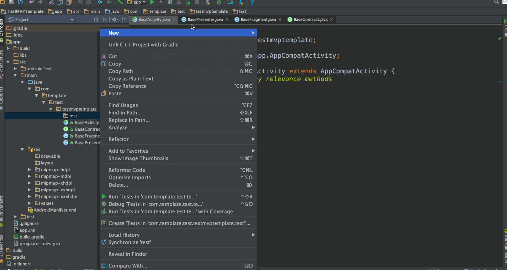

# Android-Studio-MVP-Template-Google-Architecture

This is an Android Studio template for MVP; the template is inspired by [google samples/ android architecture](https://github.com/googlesamples/android-architecture/tree/todo-mvp/)

`Important`: The main goal of this template is to speed up the development process using android mvp template. This is just a template, so feel free to make changes according to your needs. It also shows how to create a set of files using template files in Android Studio.

Thanks to [riggaroo/android-studio-group-templates-mvp](https://github.com/riggaroo/android-studio-group-templates-mvp) and [benoitletondor/Android-Studio-MVP-template](https://github.com/benoitletondor/Android-Studio-MVP-template) for the resources allow me create my own.

## Installation

#### For Mac:

- If you have a standard Android Studio installation:

Just run the install script at the root of this repository:

```
./install.sh
```


- Manual installation:

Just copy directory `MVPTemplate` to `$ANDROID_STUDIO_FOLDER$/Contents/plugins/android/lib/templates/activities/`

#### For Windows:

Just copy directory `MVPTemplate` to `$ANDROID_STUDIO_FOLDER$\plugins\android\lib\templates\activities\`

## How to use

#### 1. Create Base classes

The main idea of the base classes is to have common methods that share across the activities, fragments, contracts and presenters, written down in one place.

For instance: In our MVP template, all views will need to set the presenter so wrote a  method, setPresenter(), in the BasePresenter so all the presenters class inherite from BasePresenter need to implement the method.

Here are the needed bases classes:

- BaseActivity
```
package com.template.test.testmvptemplate; // your application package

import android.support.v7.app.AppCompatActivity;

public abstract class BaseActivity extends AppCompatActivity {
// TODO: add any relevance methods
}
```

- BaseFragment
```
package com.template.test.testmvptemplate; // your application package

import android.support.v4.app.Fragment;

public class BaseFragment extends Fragment {
// TODO: add any relevance methods
}

```

- BaseContract
```
package com.template.test.testmvptemplate; // your application package

public interface BaseContract {

interface View<T extends Presenter> {
void setPresenter(T presenter);
}

interface Presenter {
void start();

void stop();
}
}
```

- BasePresenter
```
package com.template.test.testmvptemplate; // your application package

import android.content.Context;
import android.support.annotation.NonNull;

public class BasePresenter {
protected Context mContext;

public void subscribe(@NonNull Context context) {
this.mContext = context;

public boolean isSubscribed() {
return mContext != null;
}
}
```
#### 2. Generate MVP template


#### 3. Resolve imports and add your activities to manifest
Import classes as needed. and currently this template doesnot add the created activity to manifest.xml, so you need to manually add your activity to manifest.xlm file.

## Known issue
From [Riggaroo blog/ known issue for MVP template](https://riggaroo.co.za/custom-file-template-group-android-studiointellij/):
`When upgrading Android Studio, and you have custom groups of file templates in the installation area specified above, Studio will say you have conflicts in the area that need to be deleted. Unfortunately you will have to remove them, and then place them in the same folder after the upgrade.` [Check out this feature request here](https://issuetracker.google.com/issues/37105193).

## License

Support
-------

If you've found an error in this sample, please file an issue to
https://github.com/vsay01/Android-Studio-MVP-template-google-architect
Patches are encouraged, and may be submitted by forking this project and
submitting a pull request through GitHub.

License
-------

[](https://opensource.org/licenses/Apache-2.0)

Copyright 2017 Vortana Say

Licensed under the Apache License, Version 2.0 (the "License");
you may not use this file except in compliance with the License.
You may obtain a copy of the License at

http://www.apache.org/licenses/LICENSE-2.0

Unless required by applicable law or agreed to in writing, software
distributed under the License is distributed on an "AS IS" BASIS,
WITHOUT WARRANTIES OR CONDITIONS OF ANY KIND, either express or implied.
See the License for the specific language governing permissions and
limitations under the License.

